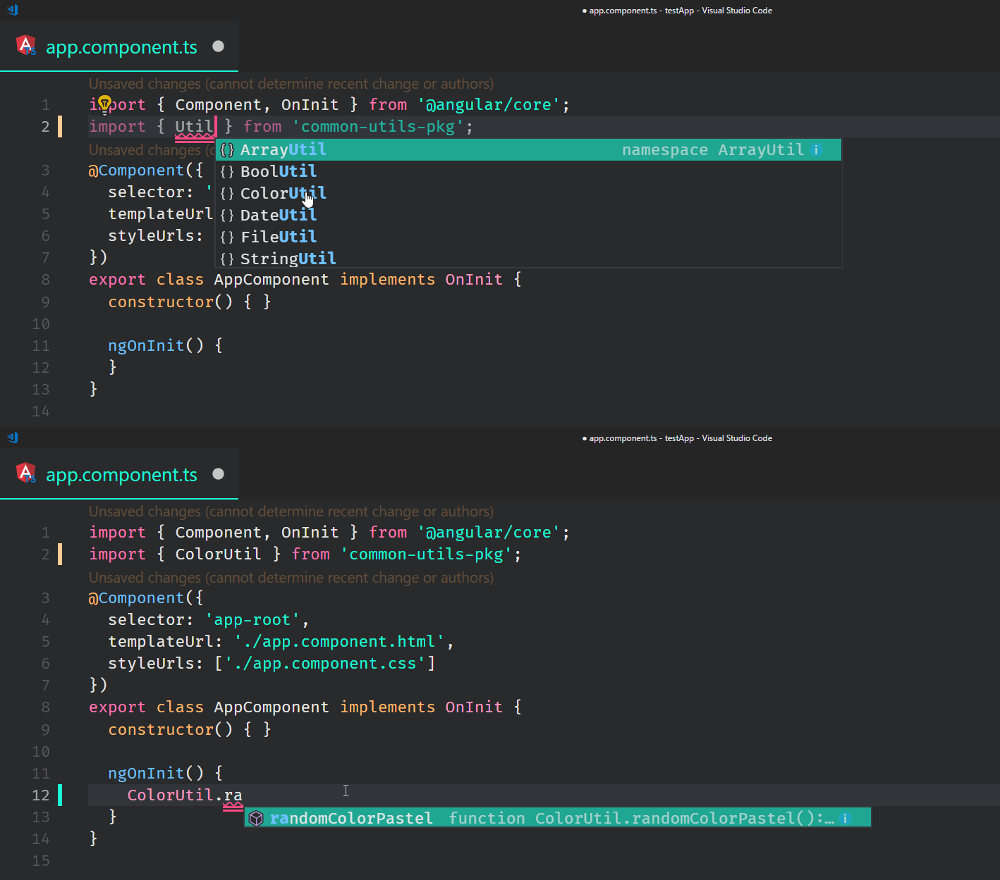

# Common Utilities Package

A package of commonly used JavaScript utilities.

[Site](https://iamdevlinph.github.io/common-utils-pkg/) | [Docs](https://iamdevlinph.github.io/common-utils-pkg/docs.html)

#### Package Details

[![npm version][npm-img]][npm-url]
[![node version][node-img]][node-url]
[![build][travis-img]][travis-url]
[![coverage][codecov-img]][codecov-url]
[![dev deps][devdeps-img]][devdeps-url]
[![downloads][downloads-img]][downloads-url]

#### Repo Details

[](https://greenkeeper.io/)
[![open issues][issues-img]][issues-url]
[![open prs][pr-img]][pr-url]

[![contributors][contributor-img]][contributor-url]

# :tada: `Version 3` is here
Version 3 introduces a code-breaking change. Each method is exported independently instead of having them under a "category utility". Read more on how to use it [here](https://iamdevlinph.github.io/common-utils-pkg/usage.html).

## Installation
NPM
```
npm i --save common-utils-pkg
```
Yarn
```
yarn add common-utils-pkg
```

## Usage

### ES6

```
// Specific methods

import { randomPastelColor } from 'common-utils-pkg';
randomPastelColor();
```

```
// All methods

import * as UTILS from 'common-utils-pkg';
UTILS.randomPastelColor();
```

### Browser

```
<script src="https://unpkg.com/common-utils-pkg"></script>
<script>
  // Specific methods

  const randomPastelColor = window['common-utils-pkg].randomPastelColor;
  randomPastelColor();
</script>
```

```
<script>
  // All methods

  const UTILS = window['common-utils-pkg'];
  UTILS.randomPastelColor();
</script>
```

Read more about the usage [here](https://iamdevlinph.github.io/common-utils-pkg/usage.html)

## Available Methods

Read more about the methods available [here](https://iamdevlinph.github.io/common-utils-pkg/docs.html)

## Features
* Transpile ES6 to ES5 using [Babel](https://github.com/babel/babel)
* Coverage using [Istanbul](https://github.com/gotwarlost/istanbul) with [nyc](https://github.com/istanbuljs/nyc) and report by [Codecov](https://github.com/codecov/codecov-node)
* Create the bundle using [webpack](https://github.com/webpack/webpack)
* Run tests using [Mocha](https://github.com/mochajs/mocha) and [chai](https://github.com/chaijs/chai)
* Lint stuff using [ESLint](https://github.com/eslint/eslint)
* Build status by [Travis](https://github.com/travis-ci/travis-ci)
* Precommit using [lint-staged](https://github.com/okonet/lint-staged) and [husky](https://github.com/typicode/husky)
* Provides TypeScript type definitions
<!--  -->

# Contributing
1.Create a folder under `src/` and name the folder with the same name as the method.

2.Create `methodName.js` and `methodName.spec.js`

The full directory should look like this:
```
src/
  methodName/
    - methodName.js
    - methodName.spec.js
```

3.If the method you are authoring has expected parameters then import `expects`

```js
import expects from '../expects/expects';
```

Wrap your exported function with `expects`
```js
export default expects(
  methodName,
  'methodName',
  { // required parameters
    0: 'string', // 1st parameter is required and is a string
    1: 'number', // 2nd parameter is required and is a number
  },
  { // optional parameters
    2: 'number' // 3rd parameter is optional but is a number
  }
)
```

<!-- Have something to pitch in? Open a [pull request](https://github.com/iamdevlinph/common-utils-pkg/pulls) or an [issue](https://github.com/iamdevlinph/common-utils-pkg/issues/new). -->

<!-- ## Commands
Run by `npm run <script>`
* `build:clean` - Deletes the build folder.
* `build` - Builds `dev` and `prod` ready files.
* `cover:serve` - Serve the coverage report page. Open at `http://localhost:8080/`.
* `cover` - Run coverage tool.
* `docu:serve` - Serve the documentation page. Open at `http://localhost:8080/`.
* `docu` - Generated a `.json` documentation file that will be used by the `docs.html` page.
* `lint:install` - Install precommit related tools. It sometimes doesn't install properly.
* `lint` - Runs the ESLint linter on the `src/` folder.
* `precommit` - The precommit hook which runs `lint-staged` to lint staged files on commit.
* `prepare` - Runs `build` before publishing a new version of the package.
* `test:watch` - Re-run tests on file changes.
* `test` - Run the tests -->

<!-- ## To Do's
- [ ] Immutable arrays and objects
- [ ] Update `takes(func, [...required])` to `takes(func, [...required], [...optional])`
- [ ] Update `takes` to support `typeof` `any`
- [ ] Update `argTypesMatch` to support `typeof` `any` -->

[contributor-img]: https://img.shields.io/github/contributors/iamdevlinph/common-utils-pkg.svg?style=flat-square&maxAge=7200
[contributor-url]: https://github.com/iamdevlinph/common-utils-pkg/graphs/contributors
[deps-img]: https://img.shields.io/david/iamdevlinph/common-utils-pkg.svg?style=flat-square&maxAge=7200
[deps-url]: https://david-dm.org/iamdevlinph/common-utils-pkg
[devdeps-img]: https://img.shields.io/david/dev/iamdevlinph/common-utils-pkg.svg?style=flat-square&maxAge=7200
[devdeps-url]: https://david-dm.org/iamdevlinph/common-utils-pkg?type=dev
[downloads-img]: https://img.shields.io/npm/dm/common-utils-pkg.svg?style=flat-square&maxAge=7200
[downloads-url]: https://npmcharts.com/compare/common-utils-pkg?minimal=true
[issues-img]: https://img.shields.io/github/issues/iamdevlinph/common-utils-pkg.svg?style=flat-square&maxAge=7200
[issues-url]: https://github.com/iamdevlinph/common-utils-pkg/issues
[node-img]: https://img.shields.io/node/v/common-utils-pkg.svg?style=flat-square&maxAge=7200
[node-url]: https://nodejs.org/en/
[npm-img]: https://img.shields.io/npm/v/common-utils-pkg.svg?style=flat-square&maxAge=7200
[npm-url]: https://www.npmjs.com/package/common-utils-pkg
[pr-img]: https://img.shields.io/github/issues-pr/iamdevlinph/common-utils-pkg.svg?style=flat-square&maxAge=7200
[pr-url]: https://github.com/iamdevlinph/common-utils-pkg/pulls
[travis-img]: https://img.shields.io/travis/iamdevlinph/common-utils-pkg/master.svg?style=flat-square&maxAge=7200
[travis-url]: https://travis-ci.org/iamdevlinph/common-utils-pkg
[codecov-img]: https://img.shields.io/codecov/c/github/iamdevlinph/common-utils-pkg.svg?style=flat-square&maxAge=7200
[codecov-url]: https://codecov.io/gh/iamdevlinph/common-utils-pkg
[forks-img]: https://img.shields.io/github/forks/iamdevlinph/common-utils-pkg.svg?style=social&label=Fork&maxAge=7200
[forks-url]: https://github.com/iamdevlinph/common-utils-pkg/network/members
[stars-img]: https://img.shields.io/github/stars/iamdevlinph/common-utils-pkg.svg?style=social&label=Stars&maxAge=7200
[stars-url]: https://github.com/iamdevlinph/common-utils-pkg/stargazers
